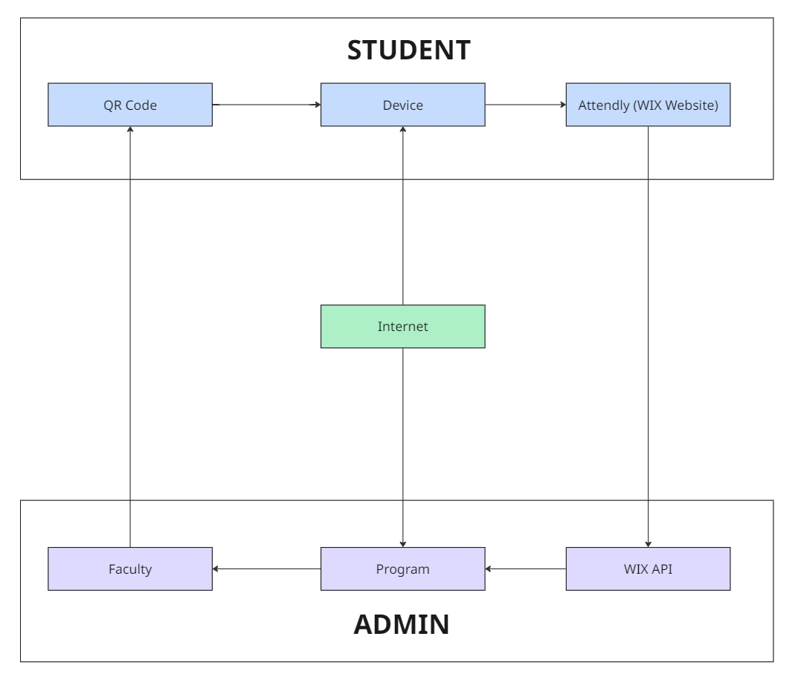
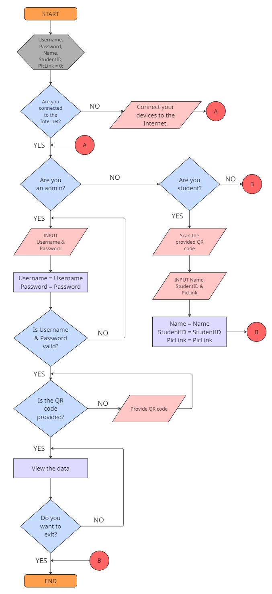

# QR-Based Student Attendance Tracking System

## 📌 Overview
This project is a GUI-based attendance tracking system that integrates a login authentication interface with a real-time attendance management dashboard.

It utilizes a Python-based frontend built with Tkinter and connects to a cloud-hosted backend API for data retrieval and manipulation. The system supports QR code generation, attendance visualization, and record management.

The architecture follows a modular design, separating authentication and attendance processing into independent components.

---

## ⚙️ System Architecture

### Block Diagram


### Flowchart


---

## 💻 Software Components

- Python 3.x  
- Tkinter (GUI Framework)  
- Requests (API communication)  
- OpenPyXL (Excel export)  
- QRCode (QR generation)  
- Python-dotenv (environment variable management)  
- Pillow (image handling)  

---

## 🚀 Key Features

- Secure login interface with credential validation  
- GUI-based attendance dashboard  
- Real-time data fetching from API  
- Search functionality (by name, ID, or date)  
- Sorting and filtering of attendance records  
- QR code generation with expiry system  
- Export attendance data to Excel (.xlsx)  
- Add, edit, and delete attendance records  
- Clickable selfie links for verification  
- Live date and time display  

---

## 🔄 System Workflow

1. User logs in through the authentication interface  
2. System validates credentials  
3. Attendance dashboard GUI is initialized  
4. Application fetches attendance data from API  
5. Data is displayed in a structured table  
6. User can:
   - Search/filter records  
   - Add/edit/delete entries  
   - Generate QR codes  
   - Export data  
7. Updates are sent back to the API  
8. GUI refreshes to reflect latest data  

---

## 🔐 Authentication System

The login module handles user authentication and session control.

- Built using Tkinter GUI  
- Validates static admin credentials  
- Controls access to the attendance dashboard  
- Manages window transitions between login and main system  

---

## 📊 Attendance Management System

The attendance module handles all core functionalities:

- API communication (GET, POST, PUT, DELETE)  
- Data formatting and display  
- Table management using Treeview  
- Record grouping and attendance counting  
- QR code generation with expiration timer  
- Excel export functionality  

---

## 🔄 System Interaction (Architecture View)

The system follows a client–server model:

**Frontend (Tkinter GUI):**
- Handles user interaction, display, and input  

**Backend API (Wix-based):**
- Stores and manages attendance data  

**Communication Pipeline:**
- GUI → API: data requests and updates  
- API → GUI: attendance records  
- QR system acts as an entry point for attendance logging  

---

## ⚠️ Limitations

- Static Authentication – Uses hardcoded credentials (username and password are set to `admin / admin`), not scalable  
- No Forgot Password Feature – Users cannot recover or reset credentials  
- Internet Dependency – Requires API connection to function  
- API Latency – Network delays may affect responsiveness  
- No Role Management – Only single admin access supported  
- UI Constraints – Tkinter limits modern UI design flexibility  
- Security Limitations – No encryption or secure authentication system  
- Manual Deployment – Requires local Python environment setup  

---

## 💡 Notes

- The system uses an environment variable (`BASE_URL`) for API configuration  
- QR codes are generated dynamically and expire after a defined time  
- Attendance records are grouped per student to calculate total presence  

---

## 📂 Project Structure

```
├── attendance_manager.py    # Main system (API, GUI, QR, export)
├── auth.py                  # Login GUI and authentication logic
│
├── assets/
│   ├── login_background.png
│   ├── submit_button.png
│   └── qr_icon.png
│
├── diagrams/
│   ├── 01_block_diagram_system_overview.png
│   └── 02_flowchart_attendance_system_logic.png
